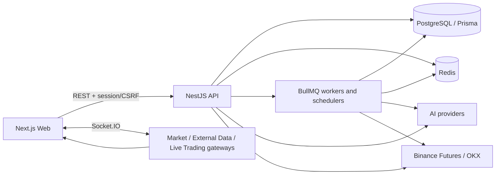
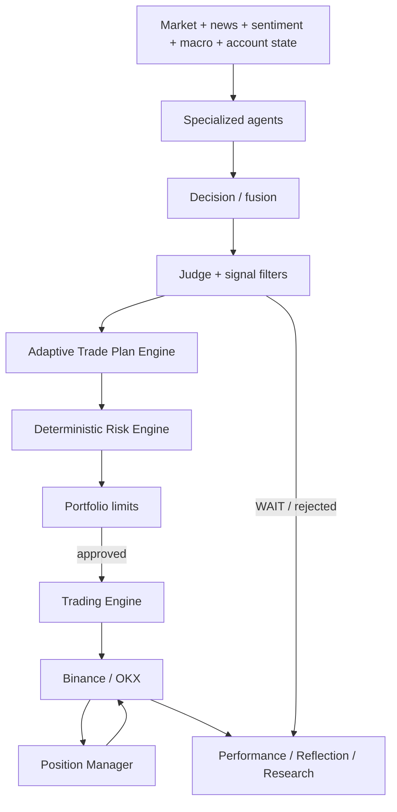
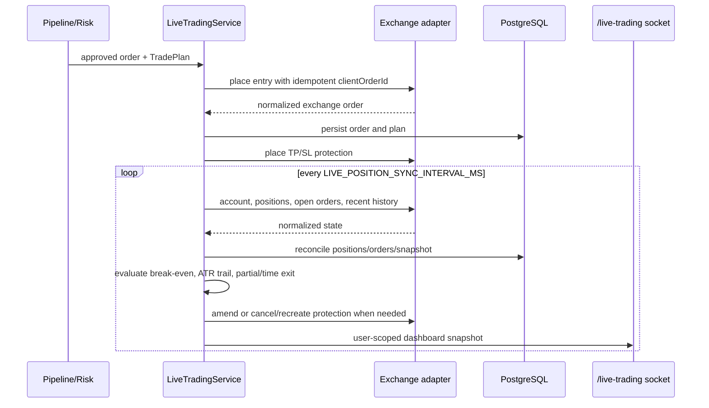

# System architecture

## Runtime topology

The pnpm workspace contains `apps/web`, `apps/api`, and `packages/shared`.
NestJS feature modules separate presentation, application, domain, and
infrastructure concerns. Prisma is the durable store; Redis provides sessions,
cache, leader leases, cancellation flags, quotas, and BullMQ transport.

## Decision and execution path

The AI layer produces structured analysis and decisions but does not own an
exchange adapter. `LiveTradingService` is the exchange mutation boundary and
requires deterministic risk approval and runtime safety gates.

## Adaptive Trade Plan Engine

The Risk Engine receives a market context assembled by the pipeline from
indicator snapshots and technical analysis:

- ATR, support, resistance;
- EMA20 and EMA50 alignment;
- ADX and 20-period efficiency ratio;
- breakout state and market structure;
- candle timeframe and estimated round-trip cost.

It resolves one of five regimes and strategies:

| Regime                    | Strategy             | Main behavior                                                           |
| ------------------------- | -------------------- | ----------------------------------------------------------------------- |
| `TREND_UP` / `TREND_DOWN` | `TREND_PULLBACK`     | Structural/ATR stop, target capped before nearby resistance/support     |
| `RANGING`                 | `RANGE_REVERSAL`     | Entry must be near a range boundary; TP is before the opposite boundary |
| `BREAKOUT`                | `BREAKOUT_RETEST`    | Structural retest stop and cost-aware target                            |
| `HIGH_VOLATILITY`         | `VOLATILITY_CONTROL` | Wider ATR trailing and shorter holding policy                           |
| Missing ATR/context       | `LEGACY_FALLBACK`    | Configured stop percentage and R:R fallback                             |

All plans validate direction, stop width, fees, and net reward/risk. This keeps
environment variables as configurable policy/fallbacks without forcing one
fixed TP/SL shape onto every market regime.

## Position lifecycle

The Position Manager only tightens protection; it does not widen an existing
stop. It tracks initial/current stop, favorable extremes, partial-taking state,
and serialized Trade Plan on `LiveOrder`. Orphan protection is cancelled after
the related position disappears.

The recent exchange history import and dashboard `orders` list are capped at 20
records. Open positions, risk state, portfolio calculations, and protection
maintenance are not intentionally capped by this display-history rule.

## Realtime channels

| Namespace        | Purpose                             | Main events                                                 |
| ---------------- | ----------------------------------- | ----------------------------------------------------------- |
| `/market`        | Public normalized market stream     | `ticker`, `candle`, `orderbook`, `trade`                    |
| `/external-data` | News/macro/sentiment notifications  | article, announcement, incident, sentiment and macro events |
| `/live-trading`  | User/connection dashboard snapshots | client `subscribe`, server `snapshot` / `exception`         |

The Live Trading gateway accepts session-cookie or supported token handshake
authentication and joins a user dashboard room. Snapshot payloads contain
connection/account state, positions, and up to 20 recent orders.

## Persistence and asynchronous work

- Market data and indicators are normalized and persisted through Prisma;
  Redis stores latest snapshots and stream leadership state.
- BullMQ owns external ingestion, agent runs, pipeline runs, schedules, retries,
  concurrency, and cancellation boundaries.
- Agent runs persist transitions, context snapshots, outputs, quota use, and
  replay relationships.
- Performance/reflection records feed self-learning experiments. Candidate
  changes pass shadow and canary governance before promotion.
- Research modules perform backtest, walk-forward/validation, sensitivity,
  benchmarking, factor/strategy discovery, simulation, and quant reporting.

## Security boundaries

- Session and CSRF identity is server-derived; user-owned reads include user ID.
- Credential secrets are AES-256-GCM encrypted and decrypted only immediately
  before provider calls.
- Secrets and signed request material are excluded from structured logs.
- Public market cache is shared; private exchange/account state is user-scoped.
- Production connections and production trading require explicit environment
  gates and recent authentication where configured.
- GET retries are bounded; exchange mutations rely on deterministic client order
  IDs and reconciliation rather than unsafe blind retries.

## Failure behavior

- Invalid/missing market context falls back to the configured legacy plan; an
  unsafe structural plan is rejected rather than guessed.
- Exchange failures are normalized and audited; the kill switch blocks new
  execution and attempts safe position/order shutdown.
- Realtime dashboard sync failures are logged and do not bypass risk controls.
- Database and Redis dependencies are exposed by `/api/health`; pipeline health
  and metrics are exposed separately under `/api/system/pipeline`.
