# Trading Platform Stabilization Design

**Status:** Design review
**Created:** 2026-08-28
**Canonical tracker:** This file is the source of truth for scope, decisions, sequencing, and continuation across model or session changes.

## Objective

Stabilize the trading platform in six independently testable and reversible delivery waves. The finished system keeps exchange execution, Judge, Risk, and release eligibility deterministic. LLMs provide bounded advisory analysis only and can never directly submit, amend, or cancel an exchange order.

## Locked Decisions

1. Runtime architecture is hybrid: deterministic agents and policies own trading decisions; LLM output is advisory.
2. LLM budget is capped at USD 10 per day and USD 100 per month. The default provider is Gemini; caching and quality gates must avoid unnecessary calls.
3. LIVE remains disabled until a strategy version passes all eligibility gates and receives one explicit user approval.
4. Approval is per strategy version, not per order. Any change to model, weights, thresholds, or strategy logic creates a new version requiring a new promotion cycle.
5. LIVE eligibility requires all of:
   - out-of-sample directional accuracy at least 55%;
   - positive expectancy;
   - profit factor at least 1.3;
   - Sharpe ratio at least 0.5;
   - maximum drawdown no greater than 10%;
   - at least 100 completed shadow trades;
   - at least 100 completed canary trades.
6. On-chain and social ingestion may use only current or free/public sources. Missing or stale coverage reduces agent weight or blocks a signal; it must never be replaced with synthetic bullish or bearish evidence.
7. Work is delivered sequentially in small commits. Each commit must pass its focused tests; each wave must pass the repository verification gate before the next wave starts.

## Audit Baseline

The runtime database audit covered 2026-08-27 19:00 Asia/Ho_Chi_Minh through approximately 2026-08-28 10:48.

- Trading was OKX DEMO. Eleven orders were recorded: four OPEN fills, one safely rejected OPEN order, four TAKE_PROFIT fills, and two STOP_LOSS fills.
- Six trades closed with net PnL +21.40458721 USDT, 66.67% win rate, profit factor 4.72, and absolute period drawdown 5.56293150 USDT.
- Pipeline runtime completed 435 runs, skipped 10 for cooldown, and failed zero. Average completed duration was 5.3 seconds and p95 was approximately 12 seconds.
- Provenance-backed directional performance was not acceptable for LIVE: 38.08% accuracy and -0.4349% average return.
- All 1,738 agent runs were deterministic with zero model tokens and no new AI history.
- Technical, Market, News, and Macro outputs were GOOD. Sentiment was almost entirely PARTIAL. On-chain had no GOOD output.
- Memory, reflection insights, improvement proposals, and scheduled quant reports had no records.
- Quant validation was weak: 1/16 walk-forward stable, 4/16 positive out-of-sample Sharpe, -0.714 average OOS Sharpe, 59.97% average probability of ruin, and 32.98% average expected drawdown.
- Data growth was noisy: 761 new hypotheses represented five titles, and 4,560 regime records represented 28 distinct scoped states.
- Unit/component verification passed 617 tests, lint, and typecheck after Prisma Client regeneration. Six integration/E2E tests were skipped. API build passed; Windows standalone web packaging failed because symlink creation returned EPERM.

## Safety Invariants

These invariants apply to every wave and may not be weakened to improve apparent execution frequency.

1. `LiveTradingService` remains the only application boundary allowed to call a private exchange mutation.
2. LLM tools cannot access order placement, cancellation, position close, credential, or kill-switch mutations.
3. Missing, partial, stale, uncalibrated, or unverifiable data fails closed for LIVE eligibility.
4. Position size is bounded by available collateral, configured exposure, leverage, stop distance, portfolio drawdown, and exchange instrument limits.
5. Entry-price drift, idempotent client-order IDs, distributed execution locks, cooldowns, and protective-order requirements remain enforced.
6. Promotion changes configuration state only; it never submits an order.
7. Every automated configuration promotion retains the previous version and a deterministic rollback path.
8. DEMO and LIVE data, credentials, metrics, and approvals remain explicitly separated.

## Target Architecture and Data Flow

```mermaid
flowchart LR
  D[Verified market and external data] --> A[Deterministic specialist agents]
  D --> L[Bounded LLM advisory]
  A --> F[Deterministic fusion and strategy selection]
  L --> F
  F --> J[Deterministic Judge]
  J --> Q[Quant validation gate]
  Q --> R[Risk and available-collateral sizing]
  R --> X[Exchange execution adapter]
  X --> G[Fill and closed-trade ledger]
  F --> P[Prediction performance]
  G --> P
  P --> M[Memory, reflection, and reports]
  M --> S[Shadow and canary evaluation]
  S --> E[LIVE_ELIGIBLE]
  E --> U[Per-version user approval]
  U --> V[LIVE-approved strategy version]
```

LLM advisory is optional input to fusion. It carries provider, model, prompt/version fingerprint, source cutoff, latency, tokens, cost, confidence, and failure state. Fusion must produce the same safe outcome when advisory is unavailable by treating it as missing evidence, never as implicit approval.

## Wave 1 — Deterministic Safety and LIVE Eligibility

**Outcome:** No strategy can reach LIVE unless empirical gates pass, the user approves the exact version, and risk sizing is based on executable collateral.

### Deliverables

- Add a deterministic LIVE eligibility evaluator with explicit metrics and sample-size failure reasons.
- Add `LIVE_ELIGIBLE`, approval, rejection, rollback, and version-invalidated lifecycle events without allowing automatic LIVE promotion.
- Bind approval to strategy version plus model/weight/threshold/configuration hashes.
- Make quant validation missing, stale, unstable, or below threshold a hard block in LIVE; DEMO may remain advisory only when explicitly configured.
- Size orders using available collateral and reserve requirements, then cap by total-equity exposure and exchange maximum size.
- Add a mismatch alert when total equity is materially larger than executable available collateral.
- Preserve the entry-price drift gate; refresh market data for one bounded re-evaluation without loosening the threshold.
- Evaluate prediction performance only from provenance-backed candles within an explicit per-horizon drift tolerance.

### Acceptance Criteria

- A strategy with any failed eligibility metric cannot become `LIVE_ELIGIBLE`.
- Passing metrics alone do not activate LIVE.
- Approval of version N cannot activate version N+1.
- An LLM response cannot change eligibility, risk approval, size, leverage, or exchange request fields.
- Order notional never exceeds executable available collateral after margin and reserve calculations.
- Out-of-tolerance performance observations are excluded from calibration and learning and are counted in diagnostics.

### Planned Commit Series

1. `test(risk): specify available-collateral position sizing`
2. `fix(risk): cap position size by executable collateral`
3. `test(quant): specify strict live eligibility gates`
4. `feat(quant): add versioned live eligibility evaluation`
5. `test(governance): require approval for exact strategy version`
6. `feat(governance): add live eligibility approval lifecycle`
7. `test(performance): reject observations outside candle drift tolerance`
8. `fix(performance): enforce provenance-backed calibration samples`
9. `test(execution): refresh once on entry price drift`
10. `fix(execution): add bounded drift re-evaluation`

## Wave 2 — Agent Data Quality and Registration

**Outcome:** Every specialist agent reports trustworthy coverage and freshness; unsupported data cannot silently influence a trade.

### Deliverables

- Standardize agent provenance: provider, source timestamp, age, coverage, unavailable fields, and data-quality reason.
- Add free/public on-chain provider fallback with symbol/network coverage mapping and bounded retries.
- Normalize Reddit public/OAuth, Alternative.me, and other configured free social observations into a source-level coverage result.
- Dynamically reduce agent contribution for PARTIAL data and remove it for INSUFFICIENT data.
- Require Judge `REQUEST_MORE_DATA` when the remaining usable analyst set cannot satisfy coverage policy.
- Persist code-defined agent registrations and version/schema hashes idempotently at startup.
- Add agent health diagnostics for registration mismatch, stale source, missing provider, and repeated partial output.

### Acceptance Criteria

- On-chain unsupported assets return neutral missing evidence with `INSUFFICIENT`, never inferred directional flow.
- Social output lists exactly which sources contributed and their observation age.
- Stale data cannot be marked GOOD.
- Agent registration contains one active row per current agent type/version and is idempotent across restarts.
- Fusion and Judge tests prove PARTIAL/INSUFFICIENT inputs reduce confidence or block safely.

### Planned Commit Series

1. `test(agents): specify shared provenance and freshness contract`
2. `feat(agents): add source coverage to specialist outputs`
3. `test(onchain): specify free-provider fallback and unsupported assets`
4. `fix(onchain): implement verified coverage fallback`
5. `test(sentiment): specify source-level social coverage`
6. `fix(sentiment): normalize free social source health`
7. `test(decision): down-weight incomplete analysts`
8. `fix(decision): enforce data-quality contribution policy`
9. `test(agents): persist definitions idempotently`
10. `fix(agents): synchronize runtime agent registrations`

## Wave 3 — Bounded LLM Advisory

**Outcome:** Gemini can add explanation and research context without gaining execution authority or exceeding budget.

### Deliverables

- Introduce an advisory contract separate from deterministic agent output and decision contracts.
- Call advisory only after minimum deterministic data quality is met and only for candidate signals or requested explanations.
- Enforce daily USD 10 and monthly USD 100 hard budgets before provider invocation.
- Cache by prompt, model, strategy version, symbol, timeframe, and source-data cutoff fingerprint.
- Persist history, token usage, cost, latency, provider/model, finish reason, and sanitized failure.
- Degrade to deterministic-only behavior on timeout, quota, provider error, invalid schema, or exhausted budget.
- Prohibit private exchange and credential tools through both compile-time tool catalogs and runtime policy.

### Acceptance Criteria

- Provider failure produces the same deterministic trading outcome as an absent advisory.
- Budget exhaustion prevents new provider calls but does not stop deterministic pipeline processing.
- Repeated identical advisory requests reuse a valid cache entry.
- Security tests prove no advisory tool path can mutate exchange state.
- AI history and usage totals reconcile with successful and failed provider calls.

### Planned Commit Series

1. `test(ai): specify non-authoritative advisory contract`
2. `feat(ai): add isolated advisory result type`
3. `test(ai): enforce daily and monthly budgets`
4. `fix(ai): apply budget gate before provider calls`
5. `test(ai): specify provenance cache fingerprint`
6. `feat(ai): add bounded advisory cache and history`
7. `test(ai): prohibit exchange mutation tools`
8. `fix(ai): enforce advisory tool capabilities`
9. `feat(pipeline): attach advisory without execution authority`

## Wave 4 — Memory, Reflection, and Performance Reporting

**Outcome:** Decisions and results become durable evidence, reflection produces governed proposals, and users receive reproducible reports.

### Deliverables

- Store normalized decision, prediction horizons, gate outcomes, execution, fills, closed-trade result, and version hashes in durable memory.
- Use deterministic fingerprints and upserts to prevent duplicate memory.
- Run reflection only when the minimum eligible sample exists and only on provenance-backed records.
- Produce proposals as immutable recommendations requiring shadow/canary validation; never apply them directly.
- Generate daily, weekly, and monthly reports with win rate, ROI, expectancy, profit factor, Sharpe, drawdown, calibration, symbol, strategy, version, and regime breakdowns.
- Distinguish prediction accuracy from actual trade performance in storage and UI contracts.

### Acceptance Criteria

- Every closed trade links to its decision, risk assessment, orders, fills, and strategy version where source data permits.
- Reprocessing the same event creates no duplicate memory or report.
- Reflection cannot create a deployable change.
- Report totals reconcile to the underlying closed-trade ledger for the same period and filters.

### Planned Commit Series

1. `test(memory): specify decision-to-result memory identity`
2. `feat(memory): persist idempotent trading memories`
3. `test(reflection): require eligible provenance sample`
4. `feat(reflection): generate governed improvement proposals`
5. `test(performance): reconcile reports to trade ledger`
6. `feat(performance): generate daily weekly monthly reports`
7. `feat(web): separate prediction and trading performance views`

## Wave 5 — Quant Lifecycle and Data Hygiene

**Outcome:** Quant research is reproducible, deduplicated, statistically gated, and produces complete benchmark and optimization artifacts.

### Deliverables

- Fingerprint and upsert hypotheses by user, symbol, timeframe, category, strategy/version, and normalized hypothesis content.
- Persist market regime only on meaningful state/confidence change or a bounded time bucket.
- Add retention and indexes for high-volume telemetry while preserving audit evidence.
- Implement factor evaluations, benchmark suites, weight optimization, threshold optimization, simulations, and quant reports from real provenance-backed inputs.
- Separate research, shadow, canary, eligible, approved, deployed, rejected, and rolled-back states.
- Treat probability fields consistently as percentages in storage and API output, with range validation from 0 through 100.

### Acceptance Criteria

- Re-running identical research does not increase hypothesis or scoped-regime cardinality.
- Every recommendation references reproducible input hashes, sample sizes, metrics, and rollback instructions.
- No optimization may consume synthetic or out-of-tolerance performance data in a deployment decision.
- Benchmark, factor, simulation, optimization, and report tables receive verified artifacts during integration tests.

### Planned Commit Series

1. `test(quant): specify hypothesis and regime identities`
2. `fix(quant): upsert hypotheses and bucket regimes`
3. `test(quant): validate probability units and ranges`
4. `fix(quant): normalize probability metrics`
5. `test(quant): require provenance for research artifacts`
6. `feat(quant): persist factor and benchmark artifacts`
7. `feat(quant): persist governed optimization experiments`
8. `feat(quant): generate reproducible quant reports`
9. `chore(database): add quant retention indexes`

## Wave 6 — Observability, Auditability, and Release Verification

**Outcome:** Operators can trace every gate and reliably build, test, deploy, and roll back the product.

### Deliverables

- Persist JUDGE, QUANT_GATE, RISK, and EXECUTION pipeline steps with duration, outcome, and safe failure reason.
- Replace ambiguous alert delivery booleans with `PENDING`, `DELIVERED`, and `FAILED`, plus attempts, last error, next attempt, and dead-letter handling.
- Ensure actionable alerts cannot remain silently undelivered.
- Run Prisma Client generation as an explicit dependency of typecheck and build.
- Make Linux CI/Docker the production build authority; retain a documented Windows development path that does not require standalone symlink packaging.
- Enable database, Redis, pipeline-to-order, exchange sandbox, protective-order, recovery, and reporting integration/E2E suites in CI.
- Add release evidence containing migrations, test counts, skipped tests, build artifacts, configuration hashes, and rollback version.

### Acceptance Criteria

- A pipeline run is traceable from input through agent, fusion, decision, Judge, quant, risk, execution, order, fill, and performance evaluation.
- Failed alert delivery is retried and eventually delivered or dead-lettered with an operator-visible error.
- CI fails when required integration/E2E tests are skipped.
- API and web production images build on Linux with the exact generated Prisma schema used by typecheck.

### Planned Commit Series

1. `test(pipeline): specify persisted governance steps`
2. `feat(pipeline): persist judge quant risk execution steps`
3. `test(alerts): specify retryable delivery lifecycle`
4. `feat(alerts): add delivery attempts and dead letter state`
5. `chore(prisma): generate client before checks and builds`
6. `ci(test): require runtime integration suites`
7. `ci(build): verify Linux production images`
8. `docs(release): record promotion and rollback evidence`

## Database and Compatibility Strategy

- Every schema change uses an additive migration first.
- Application code tolerates the old representation during a rolling deployment where required.
- Destructive cleanup and retention run only after the new read/write path has been verified.
- New uniqueness rules are preceded by deterministic deduplication and an audit count.
- Financial decimals remain decimal strings at API boundaries.
- Timestamps remain UTC in persistence and are converted only for display.

## Verification Gates

Every focused commit runs its directly affected tests. Every wave must pass all applicable gates before its status becomes complete:

1. `pnpm lint`
2. `pnpm typecheck`
3. `pnpm test`
4. Required integration and E2E suites for the changed boundary
5. `pnpm build` or Linux Docker production-image build
6. Migration apply/rollback rehearsal against a disposable database when schema changes exist
7. Runtime read-only audit confirming expected records and absence of stale or stuck states

LIVE eligibility additionally requires the empirical metrics in Locked Decision 5. Passing code tests is not evidence that a trading strategy is safe for LIVE.

## Delivery and Rollback Rules

- Implement waves strictly in numeric order.
- Do not combine waves in one commit.
- Do not combine schema migration, behavioral change, and unrelated refactoring in one commit.
- Each commit message follows the planned series or a narrower equivalent.
- A failed wave verification stops subsequent waves until the root cause is resolved.
- Runtime rollout proceeds local tests → disposable integration environment → DEMO → SHADOW → CANARY → LIVE_ELIGIBLE → user approval → LIVE.
- Rollback restores the previous approved strategy/configuration version and disables the failed version without deleting audit history.

## Continuation Protocol for a New Model or Session

On continuation, the agent must perform these steps before editing code:

1. Read this entire file.
2. Read repository `AGENTS.md` and current skill instructions.
3. Run `git status --short`, `git branch --show-current`, and `git log -10 --oneline`.
4. Locate the first wave or commit below whose status is not complete.
5. Inspect commits already recorded for that wave; never redo a completed commit.
6. Run the focused baseline test for the next commit.
7. Follow test-driven development: add one failing test, verify the expected failure, implement the minimum behavior, verify green, then commit.
8. Update only the Work Status section and append evidence to the Change Ledger before ending a session.
9. Never enable LIVE or approve a strategy version as part of development verification.

## Work Status

| Wave | State | Evidence |
|---|---|---|
| Design | REVIEW_REQUIRED | This document created; awaiting user review |
| 1. Deterministic safety and LIVE eligibility | NOT_STARTED | Blocked by design approval and implementation plan |
| 2. Agent data quality and registration | NOT_STARTED | Starts only after Wave 1 verification |
| 3. Bounded LLM advisory | NOT_STARTED | Starts only after Wave 2 verification |
| 4. Memory, reflection, and reporting | NOT_STARTED | Starts only after Wave 3 verification |
| 5. Quant lifecycle and data hygiene | NOT_STARTED | Starts only after Wave 4 verification |
| 6. Observability and release verification | NOT_STARTED | Starts only after Wave 5 verification |

Allowed states are `NOT_STARTED`, `IN_PROGRESS`, `BLOCKED`, `VERIFICATION`, and `COMPLETE`. `REVIEW_REQUIRED` is reserved for the design gate.

## Change Ledger

| Date | Wave | Commit | Verification | Notes |
|---|---|---|---|---|
| 2026-08-28 | Design | Design document | Placeholder, consistency, scope, and ambiguity review passed | Initial stabilization architecture and continuation protocol |
